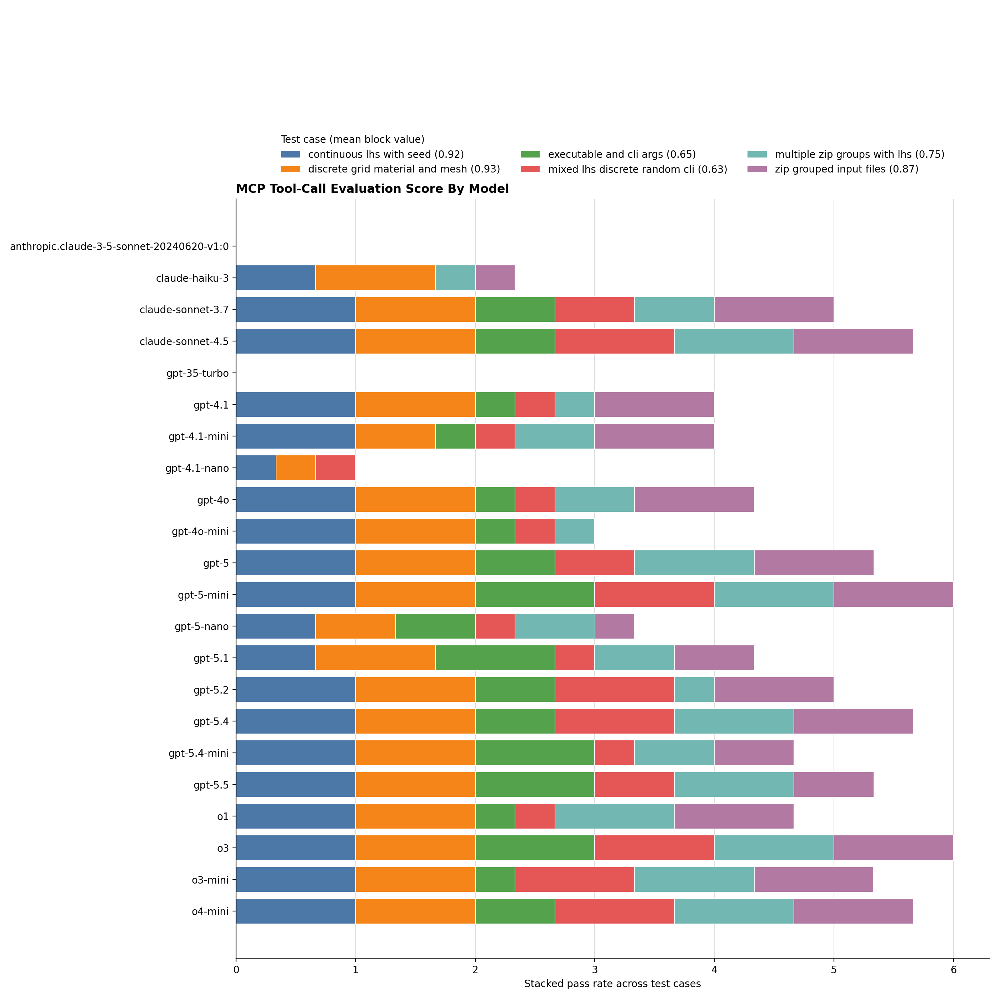
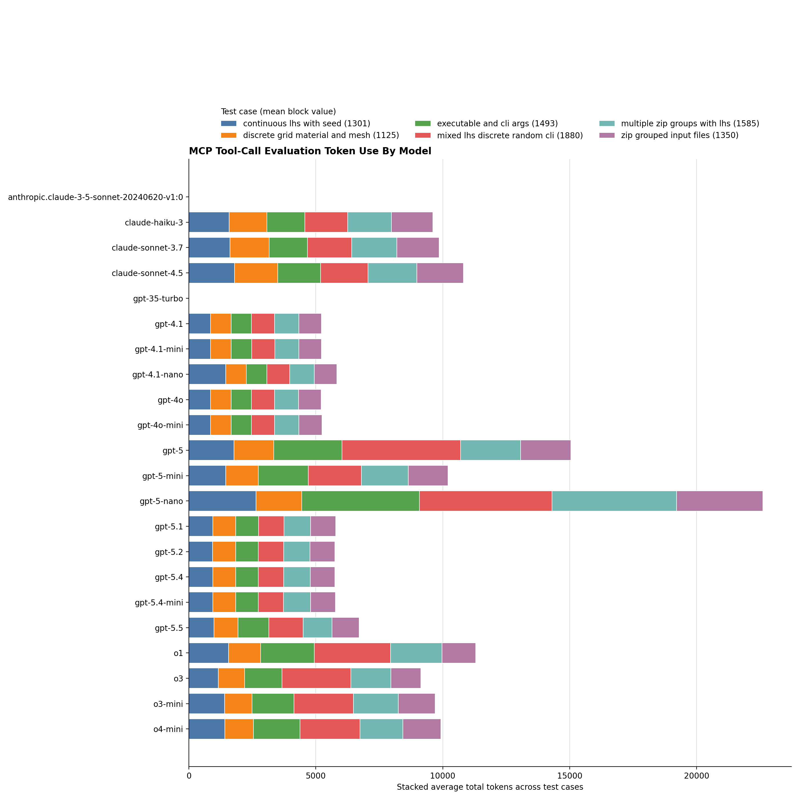

# MCP Tool Call Evaluation

The `tests/benchmark/mcp_tool_call_eval.py` script evaluates whether an LLM can select
an MCP tool and generate the expected JSON arguments for that tool. It is
useful for comparing models, prompts, and OpenAI-compatible backends without
executing the MCP tool itself.

The script is generic. This guide uses the `skeleton_example` server as the
concrete example because it is lightweight and purpose-built for testing and
documentation of `generate_parameter_runs` style tools.

## What It Tests

For each configured model, test case, and prompt variant, the runner:

- connects to the MCP server named by the test case
- discovers that server's tools
- sends one prompt to the selected LLM with those tools available
- records the first tool call returned by the model
- compares the tool name and arguments against the expected JSON
- writes per-prompt and per-case results

The runner does not call the MCP tool. This keeps the evaluation focused on
tool selection and argument generation, and avoids side effects such as
creating simulation run directories.

## Fixture Format

Fixtures are JSON files with two top-level keys:

- `mcp_servers`: named MCP server connection definitions
- `tests`: test cases that select a server and define expected tool-call behavior

Example:

```json
{
  "mcp_servers": {
    "skeleton_example": {
      "url": "http://localhost:8220/mcp"
    }
  },
  "tests": [
    {
      "id": "continuous_lhs_with_seed",
      "server": "skeleton_example",
      "expected_call": {
        "tool": "generate_parameter_runs",
        "arguments": {
          "output_dir": "/tmp/mada_skeleton_eval/continuous_lhs_with_seed",
          "num_samples": 4,
          "kernel_name": "blast_sweep",
          "input_deck_path": "/tmp/mada_skeleton_eval/decks/blast",
          "input_deck_entrypoint": "main.deck",
          "seed": 12345,
          "rng_bit_generator": "PCG64",
          "parameters": {
            "density": ["def", "continuous", [1.0, 2.5]],
            "pressure": ["def", "continuous", [10.0, 50.0]],
            "solver": ["exe", "discrete", ["skeleton_cpu"]]
          }
        },
        "match": {
          "mode": "subset",
          "profile": "parameter_runs"
        }
      },
      "prompts": [
        {
          "id": "direct",
          "text": "Create 4 Skeleton Example LHS runs in /tmp/mada_skeleton_eval/continuous_lhs_with_seed. Use deck directory /tmp/mada_skeleton_eval/decks/blast with entrypoint main.deck. Use kernel name blast_sweep. Use exact parameter names density and pressure. Numeric LHS ranges must use selection continuous, not discrete_lhs: density=[\"def\",\"continuous\",[1.0,2.5]] and pressure=[\"def\",\"continuous\",[10.0,50.0]]. Use executable parameter solver=[\"exe\",\"discrete\",[\"skeleton_cpu\"]]. Set seed 12345 and rng bit generator PCG64."
        },
        {
          "id": "natural",
          "text": "Set up a reproducible four-sample Skeleton Example sweep for the blast deck. The deck is /tmp/mada_skeleton_eval/decks/blast/main.deck, output goes to /tmp/mada_skeleton_eval/continuous_lhs_with_seed, and the kernel name is blast_sweep. Use exact parameter names density and pressure. For the numeric LHS ranges, use selection continuous: density ranges 1.0-2.5 and pressure ranges 10.0-50.0. Use executable parameter key solver with value skeleton_cpu. Sampling should use seed 12345 with PCG64."
        }
      ]
    }
  ]
}
```

`expected_call` is required:

- `expected_call.tool`: exact MCP tool name the model should call
- `expected_call.arguments`: expected JSON arguments; use `{}` for no-argument tools
- `expected_call.match`: optional matching settings

`expected_call.match.mode` defaults to `subset`. Supported modes are:

- `subset`: every expected argument must be present with the same value; extra model arguments are allowed
- `exact`: the actual arguments must exactly equal the expected arguments

`expected_call.match.profile` is optional. Supported profiles are:

- `parameter_runs`: enables equivalence rules for `generate_parameter_runs`-style simulation tools

For arbitrary MCP tools, omit `profile` unless a profile is explicitly
documented for that tool shape.

Example for a non-simulation tool:

```json
{
  "id": "monitor_read_logs",
  "server": "monitor",
  "expected_call": {
    "tool": "read_logs",
    "arguments": {
      "run_location": "/tmp/run1",
      "stdout_file": "run.out",
      "stderr_file": "run.err"
    }
  },
  "prompts": [
    "Read stdout and stderr logs for /tmp/run1 using run.out and run.err."
  ]
}
```

Prompt entries can also be strings. In that case the runner assigns IDs like
`prompt_1`, `prompt_2`, and so on.

## Running The Evaluation

### Choose Models

The repository includes a shared curated model list for the eval scripts:

```text
tests/benchmark/eval_models.txt
```

Use `tests/benchmark/populate_eval_models.py` to query the OpenAI-compatible `/models`
endpoint and refresh the discovered snapshot:

```bash
python tests/benchmark/populate_eval_models.py
```

This writes the full discovered model list to:

```text
tests/benchmark/eval_models_all.txt
```

If `tests/benchmark/eval_models.txt` does not exist yet, the helper initializes it
from the discovered list. After that, it leaves `tests/benchmark/eval_models.txt`
unchanged so you can manually curate it.

The curated file allows blank lines and `#` comments. Comment out any model you
want to omit from any testing runs for example, the tests executed by
`tests/benchmark/testskeleton.sh`.

Example:

```text
# Shared eval model list
gpt-5.5
gpt-5-mini
# gpt-4.1-mini
```

The scripts consume `tests/benchmark/eval_models.txt`. The `eval_models_all.txt` file
is only a discovery snapshot and is not used directly for eval runs.

Start the target MCP server before running the evaluator. For the skeleton
example server:

```bash
mada-mcp-skeleton-example --transport streamable-http --host localhost --port 8220
```

Then run the evaluator from the repository root:

```bash
python tests/benchmark/mcp_tool_call_eval.py \
  --cases tests/benchmark/skeleton_tool_call_eval_cases.json \
  --models gpt-5.5 gpt-5-mini gpt-4.1-mini \
  --results-csv tests/benchmark/results/se_tool_call_rows.csv \
  --results-json tests/benchmark/results/se_tool_call_rows.json \
  --summary-csv tests/benchmark/results/se_tool_call_summary.csv \
  --summary-json tests/benchmark/results/se_tool_call_summary.json
```

The `--models` argument accepts one or more model names. Each prompt variant is
evaluated independently for each model.

During a run, the evaluator prints live progress by default. It reports MCP
server connection status, the current prompt counter, model, server, case ID,
prompt ID, result, latency, token usage, and error details.

Example progress lines:

```text
Evaluating 54 prompts across 3 models, 6 test cases, and 1 configured MCP servers.
Connecting to MCP server 'skeleton_example' at http://localhost:8220/mcp ...
Connected to 'skeleton_example' with 1 tools in 142ms.
[12/54] START model=gpt-5-mini server=skeleton_example case=mixed_lhs_discrete_random_cli prompt=natural
[12/54] FAIL latency_ms=19320 tokens=2114 error_type=arg_mismatch error=missing $.parameters.restart_args
```

Use `--quiet` to suppress live progress output:

```bash
python tests/benchmark/mcp_tool_call_eval.py \
  --cases tests/benchmark/skeleton_tool_call_eval_cases.json \
  --models gpt-5-mini \
  --quiet
```

Use `--no-final-table` when CSV or JSON artifacts are enough:

```bash
python tests/benchmark/mcp_tool_call_eval.py \
  --cases tests/benchmark/skeleton_tool_call_eval_cases.json \
  --models gpt-5-mini \
  --results-csv tests/benchmark/results/se_tool_call_rows.csv \
  --no-final-table
```

The detailed JSON output includes the prompt, expected call, parsed actual
arguments, raw tool argument string, assistant text, raw assistant message, and
raw tool-call objects. This is the best artifact for inspecting why a model
failed.

Use `--capture-raw-response` to also include the full OpenAI-compatible API
response object in `--results-json`:

```bash
python tests/benchmark/mcp_tool_call_eval.py \
  --cases tests/benchmark/skeleton_tool_call_eval_cases.json \
  --models gpt-5-mini \
  --results-json tests/benchmark/results/se_tool_call_rows.json \
  --capture-raw-response
```

## Full Script Example

If you want one command that creates a timestamped output directory, runs the
evaluation, and writes the plots, use `tests/benchmark/testskeleton.sh`:

```bash
bash tests/benchmark/testskeleton.sh
```

Its current contents are:

```bash
#!/usr/bin/env bash
set -euo pipefail

cd "$(dirname "$0")"

models_file="${MCP_EVAL_MODELS_FILE:-eval_models.txt}"
if [[ ! -f "$models_file" ]]; then
  echo "Model list file not found: $models_file" >&2
  exit 1
fi

models=()
while IFS= read -r line; do
  line="${line#"${line%%[![:space:]]*}"}"
  line="${line%"${line##*[![:space:]]}"}"
  if [[ -z "$line" || "${line:0:1}" == "#" ]]; then
    continue
  fi
  models+=("$line")
done < "$models_file"

if [[ "${#models[@]}" -eq 0 ]]; then
  echo "No enabled models found in $models_file" >&2
  exit 1
fi

timestamp="$(date '+%Y-%m-%d_%H-%M-%S')"
output_dir="results/skeleton_${timestamp}"
mkdir -p "$output_dir"

eval_status=0
python mcp_tool_call_eval.py \
  --cases skeleton_tool_call_eval_cases.json \
  --models "${models[@]}" \
  --results-csv "$output_dir/se_tool_call_rows.csv" \
  --results-json "$output_dir/se_tool_call_rows.json" \
  --summary-csv "$output_dir/se_tool_call_summary.csv" \
  --summary-json "$output_dir/se_tool_call_summary.json" \
  --capture-raw-response || eval_status=$?

if [[ -f "$output_dir/se_tool_call_summary.csv" ]]; then
  python plot_tool_call_eval_results.py \
    --summary "$output_dir/se_tool_call_summary.csv" \
    --score-output "$output_dir/se_tool_call_score.png" \
    --tokens-output "$output_dir/se_tool_call_tokens.png"
else
  echo "Skipping plot generation because $output_dir/se_tool_call_summary.csv was not created." >&2
fi

echo "Wrote Skeleton eval results and plots to $output_dir"
exit "$eval_status"
```

This produces a timestamped run folder under `tests/benchmark/results/` and keeps the
CSV, JSON, and plot outputs from the same run together. If some prompt cases
fail, the script still generates plots from the summary CSV and then exits with
the evaluator's original non-zero status.

## Example Output

The example outputs below come from the real run directory:

```text
tests/benchmark/results/skeleton_2026-06-23_09-37-30/
```

That directory contains:

```text
skeleton_2026-06-23_09-37-30/
├── se_tool_call_rows.csv
├── se_tool_call_rows.json
├── se_tool_call_score.png
├── se_tool_call_summary.csv
├── se_tool_call_summary.json
└── se_tool_call_tokens.png
```

Excerpt from `se_tool_call_summary.csv`:

```csv
model,server,case_id,prompts_passed,prompts_total,pass_rate,all_passed,any_passed,avg_prompt_tokens,avg_completion_tokens,avg_total_tokens,avg_latency_ms
gpt-4.1-mini,skeleton_example,continuous_lhs_with_seed,3,3,1.0,True,True,731.333,126.0,857.333,2379.667
gpt-4.1-mini,skeleton_example,discrete_grid_material_and_mesh,1,3,0.333,False,True,702.667,109.667,812.333,1921.0
gpt-4.1-mini,skeleton_example,executable_and_cli_args,1,3,0.333,False,True,696.333,114.0,810.333,2493.0
gpt-4.1-mini,skeleton_example,mixed_lhs_discrete_random_cli,1,3,0.333,False,True,743.0,167.333,910.333,2740.333
gpt-4.1-mini,skeleton_example,multiple_zip_groups_with_lhs,1,3,0.333,False,True,764.667,184.333,949.0,3703.667
gpt-4.1-mini,skeleton_example,zip_grouped_input_files,3,3,1.0,True,True,749.0,142.333,891.333,2292.667
```

Score plot:



Token plot:



## API Configuration

The script can read API settings from CLI arguments, a config file, or
environment variables.

Precedence is:

1. CLI arguments: `--api-key`, `--base-url`
2. Config file values from `--config`
3. Environment variables: `API_KEY`, `API_BASE_URL`
4. Default base URL: `https://livai-api.llnl.gov/v1`

The config file can use the same model section shape as the example agent
configs:

```json
{
  "model": {
    "api_key": "${API_KEY}",
    "base_url": "${API_BASE_URL:-https://livai-api.llnl.gov/v1}"
  }
}
```

For a local OpenAI-compatible server that does not require authentication, the
evaluator uses `dummy` as the API key when the base URL starts with
`http://localhost` or `http://127.0.0.1`.

Example with a local backend:

```bash
python tests/benchmark/mcp_tool_call_eval.py \
  --base-url http://localhost:8000/v1 \
  --api-key dummy \
  --cases tests/benchmark/skeleton_tool_call_eval_cases.json \
  --models gemma4-12b
```

## Matching Behavior

By default, argument comparison is recursive subset matching. Every field in
`expected_call.arguments` must be present in the model's actual tool arguments
with the same value, but the model may include additional optional fields.

Subset mode by itself is generic and does not apply simulation-specific
normalization. Add `"profile": "parameter_runs"` to `expected_call.match` to
accept a small set of contract-equivalent forms that commonly occur in
`generate_parameter_runs` tool calls:

- executable parameter aliases: if the expected parameter is an `["exe", ...]` parameter, another actual parameter key with the same `["exe", ...]` value is accepted
- deck file path splitting: `input_deck_path=/path/to/deck/input.deck` is accepted as equivalent to `input_deck_path=/path/to/deck` plus `input_deck_entrypoint=input.deck`
- dependency path splitting: absolute dependency paths under `input_deck_path` are accepted as equivalent to expected relative dependencies
- CLI parameter grouping: fixed discrete `["cli", ...]` parameters can be matched by renamed or combined actual CLI parameters when the argv token sequence is present
- zip group identifiers: `zip` parameters can use different group id labels when the same expected parameters remain grouped together and independent groups do not collapse
- numeric string values for discrete `def` parameters: expected numeric values such as `[1]` can match actual string values such as `["1"]`
- JSON-encoded list strings: expected values such as `["Aluminum", "Steel"]` can match actual values such as `"[\"Aluminum\", \"Steel\"]"` when the decoded JSON is the same list

Use `--strict` to require exact argument equality for every test, overriding
fixture match modes and profiles:

```bash
python tests/benchmark/mcp_tool_call_eval.py \
  --cases tests/benchmark/skeleton_tool_call_eval_cases.json \
  --models gpt-5-mini \
  --strict
```

The default subset behavior is usually better for prompt/model evaluation
because MCP schemas often include optional arguments with defaults.

## Results

The console output includes:

- one row per `model x server x case_id x prompt_id`
- a summary table grouped by `model x server x case_id`

When `--results-csv` is provided, the per-prompt CSV is written incrementally.
The header is written before the evaluation loop, and each completed prompt row
is flushed immediately. This makes partial results available if a long run is
interrupted.

JSON outputs and summary outputs are written at the end of the run.

Per-prompt CSV fields:

```text
model,server,case_id,prompt_id,passed,error_type,error,expected_tool,actual_tool,prompt_tokens,completion_tokens,total_tokens,latency_ms
```

Per-case summary CSV fields:

```text
model,server,case_id,prompts_passed,prompts_total,pass_rate,all_passed,any_passed,avg_prompt_tokens,avg_completion_tokens,avg_total_tokens,avg_latency_ms
```

Use `--min-pass-rate` to set the process exit criteria from the per-case
summary. For example, this requires every prompt variant in each case to pass:

```bash
python tests/benchmark/mcp_tool_call_eval.py \
  --cases tests/benchmark/skeleton_tool_call_eval_cases.json \
  --models gpt-5-mini \
  --min-pass-rate 1.0
```

For exploratory model comparison, a lower threshold can be useful:

```bash
python tests/benchmark/mcp_tool_call_eval.py \
  --cases tests/benchmark/skeleton_tool_call_eval_cases.json \
  --models gpt-5-mini gemma4-12b \
  --min-pass-rate 0.8
```

## Interpreting Failures

Common `error_type` values:

- `api_error`: the OpenAI-compatible API request failed
- `no_tool_call`: the model returned text instead of a tool call
- `bad_json`: the model returned tool arguments that were not valid JSON
- `wrong_tool`: the selected tool name did not match the expected tool
- `arg_mismatch`: the tool name matched, but expected arguments were missing or different

For local or non-OpenAI models, the most common issues are missing tool-call
support, malformed arguments, and missing token usage data. When token usage is
not provided by the backend, the runner reports token fields as empty in CSV
and `null` in JSON.
