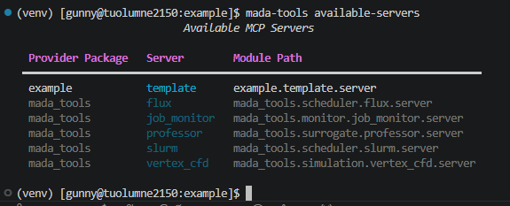

# Creating Plugin MCP Servers

Plugin MCP servers are useful for several reasons, including:

- **Version control**, you can pin server behavior to a specific release
- **Security**, you can restrict execution to audited code paths and controlled dependencies
- **Isolation**, each server can run with its own environment and permissions
- **Reuse**, share common tools across projects without copying code
- **Maintainability**, smaller servers are easier to test, deploy, and update independently

Creating plugin MCP servers for MADA typically involves three steps:

1. Install the MADA tools repository
2. Create an MCP server
3. Register the server in `pyproject.toml`

This page will cover each step at a high level.

## Installing the MADA Tools Repository

Make sure you have the `mada-tools` library installed. See [Installation](../../user_guide/installation.md) for more.

## Creating an MCP Server

In your project, create a python file to house your MCP server.

In this file, start by importing the [`BaseMCPServer`](../shared/base_server.md#shared.base_server.BaseMCPServer) class:

```python
from mada_tools import BaseMCPServer
```

Next, create your server class. Below is a template class that you can start from:

```python
from mada_tools import BaseMCPServer


class TemplateServer(BaseMCPServer):
    """
    This is a template MCP server class for MADA.

    To customize this:
    1. Update the args to `super().__init__()` in the constructor
    2. Add your own MCP tools in `_register_tools()`
    """

    def __init__(self):
        """
        Constructor for the TemplateServer.
        """
        super().__init__("Template Server", "A template MCP server.")

    def _register_tools(self):
        """Register MCP tools."""

        @self.mcp.tool()
        def custom_mcp_tool(self):
            """
            Each tool you create in `_register_tools()` should be decorated
            with `@self.mcp.tool()` and given a detailed docstring. Every argument
            should be documented as well.
            """
```

At the bottom of this file, create a main function that initializes and runs this server:

```python
def main():
    """Main entry point for the Template MCP server."""
    server = TemplateServer()
    server.run_with_args("template-server")


if __name__ == "__main__":
    main()
```

## Register the Server in `pyproject.toml`

Once you have your server file created, all that's left is to register the server in your `pyproject.toml` file as an entry point for `mada_tools`. Below is an example using the `TemplateServer` from the [previous section](#creating-an-mcp-server). In this example, we assume the server is located at `template/server.py` of the `example` project.

```toml
[project.entry-points."mada_tools.servers"]
template = "example.template.server"
```

Now when you install your library, your server will be available with MADA.

## Validating the Server Registration

In order to check that your server is available with MADA, use the [`mada-tools available-servers`](../../user_guide/cli.md#available-servers-mada-tools-available-servers) command. For example, after following the previous set of instructions for the template server, you should see output like so:


