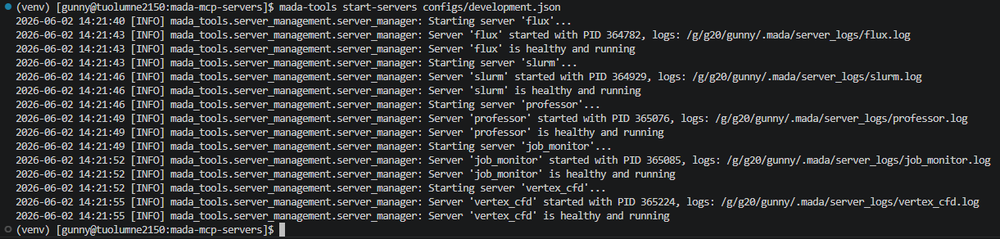
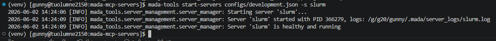
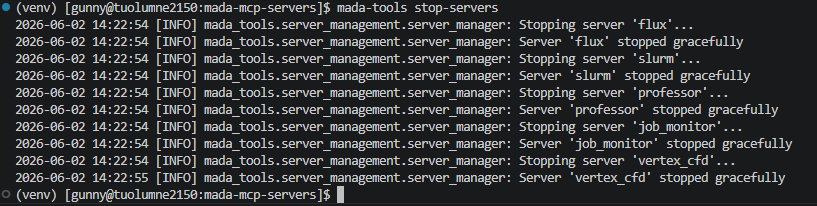
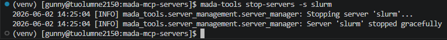
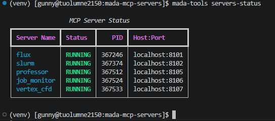
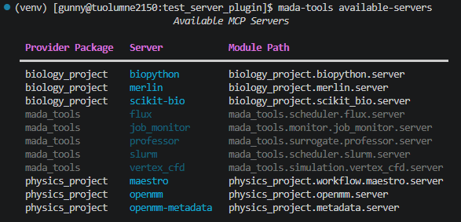

# Server Management

Before using any MADA applications, you must ensure that the required MCP servers are running. This page describes how to manage your MCP servers through CLI commands.

## Starting Servers

Servers can be started with the `mada-tools start-servers` command. This command requires that you provide [a configuration file](./configuration.md) to define:

1. Which servers you want to start
2. Where each server should be started

Once the configuration file has been provided, you can choose whether to start all servers in the file or a subset of them. To start all servers, just pass in the configuration file:

```bash
mada-tools start-servers my_config.json
```

To start a subset of servers, use the `-s` or `--servers` flag. For example:

```bash
mada-tools start-servers my_config.json -s server1 server2
```

*Here, `server1` and `server2` must be defined in `my_config.json`.*

When servers are started, their state is tracked in a state file. To write this state to a specific file, use the `-f` or `--state-file` flag. For example:

```bash
mada-tools start-servers my_config.json -f custom_state_file.json
```

??? Example "Starting All Servers in this Repo"

    All of the available servers for the MADA Tools repository are defined in `configs/development.json` from the top of the repository. This file looks like so:

    ```json
    --8<-- "configs/development.json"
    ```

    We'll use this file to start every MCP server:

    ```bash
    mada-tools start-servers configs/development.json
    ```

    After running this command we should see output similar to the following:

    

    From here, you can use the `servers-status` command to check the status of the servers. More on this command can be found [here](#checking-server-statuses).

??? Example "Starting Just SLURM"

    All of the available servers for the MADA Tools repository are defined in `configs/development.json` from the top of the repository. This file looks like so:

    ```json
    --8<-- "configs/development.json"
    ```

    In this file, the SLURM MCP Server is defined in addition to others. Let's start just the SLURM server:

    ```bash
    mada-tools start-servers configs/development.json -s slurm
    ```

    After running this command we should see output similar to the following:

    

## Stopping Servers

Servers can be stopped with the `mada-tools stop-servers` command. To stop all of the currently running servers, use:

```bash
mada-tools stop-servers
```

Currently running servers are determined behind the scenes by querying the state file. More about this can be found [below](#checking-server-statuses). To change which state file you're querying, use the `-f` or `--state-file` flag:

```bash
mada-tools stop-servers -f custom_state_file.json
```

To stop a subset of servers, use the `-s` or `--servers` flag. For example:

```bash
mada-tools stop-servers -s server1 server2
```

You can also stop just the servers in a configuration file with the `-c` or `--config` flag. For example:

```bash
mada-tools stop-servers -c my_config.json
```

??? Example "Stopping All Running Servers"

    To show this example, let's first start a bunch of servers:

    ```bash
    mada-tools start-servers configs/development.json
    ```

    Now, let's stop them all:

    ```bash
    mada-tools stop-servers
    ```

    After running this command we should see output similar to the following:

    

??? Example "Stopping Just SLURM"

    To show this example, let's first start a bunch of servers:

    ```bash
    mada-tools start-servers configs/development.json
    ```

    Now, let's stop just the SLURM server:

    ```bash
    mada-tools stop-servers -s slurm
    ```

    After running this command we should see output similar to the following:

    

## Restarting Servers

Servers can be restarted with the `mada-tools restart-servers` command. Behind the scenes, this command first [stops every server](#stopping-servers) and then [starts every server](#starting-servers). Because it's starting servers, this command requires that you provide [a configuration file](./configuration.md).

To restart every server in the configuration file, use:

```bash
mada-tools restart-servers my_config.json
```

To restart a subset of servers, use the `-s` or `--servers` flag. For example:

```bash
mada-tools start-servers my_config.json -s server1 server2
```

*Here, `server1` and `server2` must be defined in `my_config.json`.*

## Checking Server Statuses

When servers are spun up using the MADA Tools library, their statuses are tracked in a state file. By default, this state file will be located at `~/.mada/server_statuses.json`. This can be changed and will be discussed in this section.

These state files track server metadata like their status, the host and port that the server is running on, etc. Possible statuses are:

| Status    | Description                                               |
| --------- | --------------------------------------------------------- |
| STOPPED   | The server is not running.                                |
| STARTING  | The server is in the process of starting.                 |
| RUNNING   | The server is running and healthy.                        |
| UNHEALTHY | The server is running but failed health checks.           |
| FAILED    | The server failed to start or encountered a fatal error.  |

The status of servers can be checked using the `mada-tools servers-status` command. To check the status of all servers that exist in the state file, use:

```bash
mada-tools servers-status
```

Using the `-c` or `--config` flag you can check the status of servers from a specific configuration:

```bash
mada-tools servers-status -c my_config.json
```

To check the status of specific servers use the `-s` or `--servers` flag. For example:

```bash
mada-tools servers-status -s server1 server2
```

*Here, `server1` and `server2` must exist in the state file.*

To change which state file to read the status from, use the `-f` or `--state-file` flag. For example:

```bash
mada-tools servers-status -f custom_state_file.json
```

??? Example "Checking Status of All Servers"

    Let's start all servers using:

    ```bash
    mada-tools start-servers configs/development.json
    ```

    Now we can check that they're running using:

    ```bash
    mada-tools servers-status
    ```

    After running this command we should see output similar to the following:

    

## Viewing Available Servers

The MADA library comes with built in MCP servers (see [Supported Servers](../user_guide/supported_servers/index.md)) that will always be available to you. In addition to these built in servers, MADA also comes with the ability to [add plugin servers](../developer_guide/server_creation/plugin_servers.md).

In order to see all of the servers available to you, utilize the [`mada-tools available-servers`](./cli.md#available-servers-mada-tools-available-servers) command. For instance, say I've installed two plugin server packages: `physics_package` and `biology_package`, and in each package there are 3 servers. I can check that I have access to all of these servers with:

```bash
mada-tools available-servers
```

In this case, the output looks like so:


